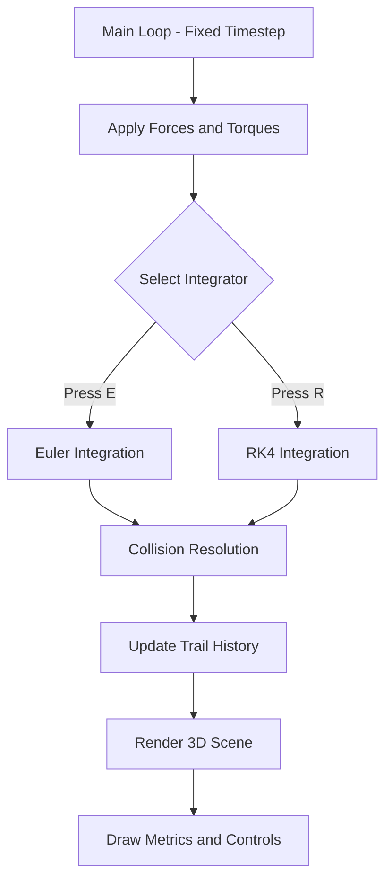

<p align="center">
  
  
</p>

# ⚛️ Engine de Física

**Uma Engine de Física 3D em C puro com foco em precisão numérica e comparação de integradores.**

> *"Não basta simular, é preciso conservar a energia."*

---

## Visão Geral

A **Engine de Física** é um simulador de corpos rígidos (`Rigid Body Dynamics`) desenvolvido em C como trabalho acadêmico. O grande diferencial do projeto é a implementação **dual** de integradores numéricos:

- **Método de Euler (Explícito)** – rápido, mas instável para passos longos.
- **Método de Runge-Kutta 4ª Ordem (RK4)** – mais custoso, porém extremamente preciso e estável.

O usuário pode alternar entre os dois métodos **em tempo real** (tecla `R` / `E`) e observar, através de um rastro visual (trail) e da métrica de energia cinética, a degradação da simulação quando o Euler é utilizado.

---

## Principais Funcionalidades

- ✅ **Corpos Rígidos 3D** com posição, velocidade, orientação (Quatérnios) e Tensor de Inércia.
- ✅ **Loop de Física com Passo Fixo** (*Fixed Timestep*) – a física roda a 60 Hz independente do FPS.
- ✅ **Seletor de Integradores (Euler vs RK4)** com chaveamento via teclado.
- ✅ **Colisões Simples** (Esfera-Plano e Esfera-Esfera) com correção de posição (*Slop*).
- ✅ **Visualização 3D Interativa** com câmera orbital (Raylib).
- ✅ **Rastro Dinâmico (Trail)** que evidencia a estabilidade do RK4.
- ✅ **Métricas em Tempo Real** (Energia Cinética, Método ativo, FPS).

---

Markdown
## Compilação e Execução

### Pré-requisitos

- **Windows:** [Raylib Installer para Windows](https://www.raylib.com/) (inclui o ambiente **w64devkit** com GCC pré-configurado).
- **Linux (Alternative):** `sudo apt install libraylib-dev`

### Passo a Passo no Windows (w64devkit)

Como o projeto utiliza múltiplos arquivos fonte organizados em pastas, a compilação deve ser feita utilizando o compilador nativo que acompanha a Raylib.

1. Abra o **VS Code** na pasta raiz do projeto.
2. Abra o terminal integrado (`Ctrl + ~`) e configure o ambiente abrindo o console do `w64devkit`:

   ```bash
   C:\raylib\w64devkit\w64devkit.exe

3. Compilando pelo w64devkit:
    ```bash
    gcc src/main.c -o main.exe -lraylib -lopengl32 -lgdi32 -lwinmm
    ```

### Passo a Passo no Linux (Ubuntu/Debian)

1. Certifique-se de ter as dependências de desenvolvimento e a Raylib instaladas:
   ```bash
   sudo apt update
   sudo apt install build-essential libraylib-dev libx11-dev libopenal-dev libgl1-mesa-dev libglu1-mesa-dev
   ```

2. Navegue até a raiz do projeto e execute o comando de compilação:
    ```bash
    gcc -o phoenix src/*.c -Iinclude -lraylib -lGL -lm -lpthread -ldl -lrt -lX11
    ```

3. Após gerar o binário, dê a permissão de execução (se necessário) e rode o simulador:
    ```bash
    chmod +x phoenix
    ./phoenix
    ```

## Controles

 | Tecla | Ação |
 | ----- | ---- |
 | ESC | Fecha a janela |

##  Cenários de Demonstração
O projeto possui 2 cenários pré-configurados no main.c:

1. Órbita Gravitacional – Uma partícula em campo central F = -G/r². Mostra a diferença brutal de estabilidade.

2. Queda com Empilhamento – Três esferas caindo sobre um plano, com colisões e atrito simplificado.

## Divisão de Tarefas (Equipe de 6 Pessoas)

| Módulo | Responsáveis | Entregáveis |
|-- | -- | -- |
| Fundação Matemática | Dupla A | operações vetoriais, normalização, produto, quatérnios e matrizes de rotação. |
| Dinâmica e Estado | Dupla B | struct do corpo, acúmulo de forças/torques e cálculo do tensor de inércia. |
| Integradores (Core) | Dupla B (líder) |  implementação do Euler e RK4 com função de derivada unificada. |
| Detecção e Resposta | Dupla C | detecção Esfera-Plano/Esfera-Esfera e aplicação de impulso linear/angular. |
| Renderização e Loop | Dupla D | janela Raylib, câmera 3D, desenho dos objetos, rastro (trail) e chaveamento de teclas. |
| Testes e Documentação | Todos (Rotativo) | Validação da conservação de energia, integração contínua e elaboração do README. |

## Sobre os Commits

Para manter o repositório organizado e o histórico limpo, utilizamos um padrão simples de commits baseado em **tipos**. Cada mensagem de commit deve começar com uma palavra-chave em maiúsculas, seguida de dois-pontos e uma breve descrição no imperativo.

### Tipos Permitidos

| Tipo | Quando usar |
| :--- | :--- |
| **ADD** | Nova funcionalidade, arquivo ou função implementada. |
| **UPDATE** | Melhoria ou aprimoramento de uma funcionalidade existente (sem quebrar compatibilidade). |
| **FIX** | Correção de bug, erro numérico ou vazamento de memória. |
| **REMOVE** | Remoção de código obsoleto, comentários ou arquivos mortos. |
| **REFACTOR** | Reestruturação do código sem alterar o comportamento externo (ex: renomear variáveis, dividir funções). |

### Exemplos

```bash
ADD: função para calcular atrito

UPDATE: melhorar resposta de colisão com correção posicional (slop)

FIX: resolver divisão por zero na colisão esfera-plano

REMOVE: remover declarações de debug desnecessárias

REFACTOR: separar lógica de renderização do loop principal de física
```

## Arquitetura do Projeto

```
physics-engine/
├── README.md
├── ...
├── include/
│   ├── ...
└── src/
    ├── ...
```

## 🧠 Arquitetura do Sistema

Arquitetura geral do sistema



##  Agradecimentos
